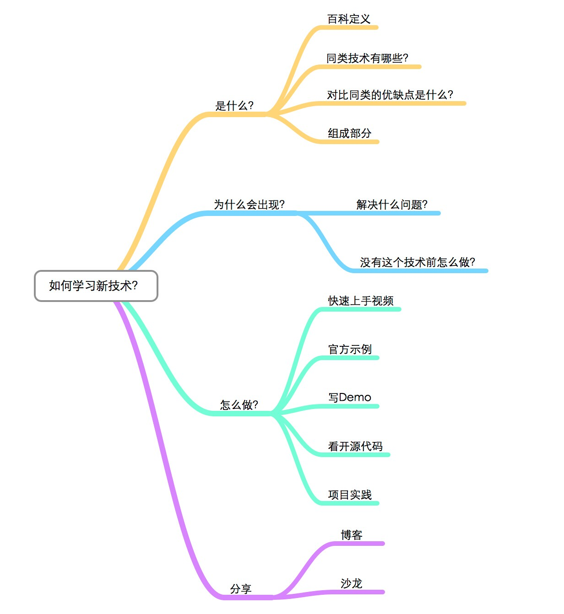

## 本文初衷
- 把自己模块化
- 与同行沟通心得

## 当我们要学习新技术/东西

- 在过去未被自己流程化的情况下，自己学习新的东西的时候一直是处理迷迷糊糊的状态，直到我看到这张思维导图，我瞬间就理清自己平时在学习东西时候那混乱的思维了。
- 可能平时我们也是这样做的，可是我们从来没有认真思考过或是整理过这样的思绪。也许你认为这样不重要，但是对我而言，有记录的东西，代表可以被流程化，这可以帮助特定情况下的我。
- 后续博客都会按照这个风格往下写

> 本学习方法参照，非常感谢：http://code.youmeek.com/2016/03/07/2016/02/My-Learning-Way/

## 文章列表
- [HttpClient深入浅出](./blog/2016/2016-10-04-HttpClient详解.md)
- [Java命名规范](./blog/2016/2016-10-09-Java命名规范.md)
- [SpringMVC集成JSR-303验证](./blog/2016/2016-10-10-SpringMVC集成JSR-303验证.md)
- [东普微应用前端开发指南](blog/2016/2016-05-15-东普微应用前端开发指南.md)
- [协同平台优化案例](http://fromwiz.com/share/s/3VChk60GcAg82s0Woi01TNjf3bQVdP1BOAeN2kQQQM3oMUwJ)
- [移动前端系列——移动页面性能优化](http://fromwiz.com/share/s/3VChk60GcAg82s0Woi01TNjf3M-lZO0p44102VIZ_Q3HsL4r)
- [MySQL数据类型](http://fromwiz.com/share/s/3VChk60GcAg82s0Woi01TNjf2ankUq0PuAV12n_0kJ3p2_Dr)
- [多模块打包](http://fromwiz.com/share/s/3VChk60GcAg82s0Woi01TNjf1_dfXA2WvQKA2kp1bU00wXcN)
- [OAuth认证实现机制及单点登录原理](http://fromwiz.com/share/s/3VChk60GcAg82s0Woi01TNjf1v5NCM0-ekS_2jefa_3d5GF7)
- [微应用开发规范指导分享](http://fromwiz.com/share/s/3VChk60GcAg82s0Woi01TNjf277E-O0z8klF2rbXdC2jcu5e)
- [我X，你不会Google么？](http://fromwiz.com/share/s/3VChk60GcAg82s0Woi01TNjf0Ro1K61Jm4Yd28DJju00DqUM)
- [单点登录原理与简单实现](http://fromwiz.com/share/s/3VChk60GcAg82s0Woi01TNjf3Sa-e70lSkKd2CiQIP178cjy)
- [window下的包管理器——Chocolatey教程](http://fromwiz.com/share/s/3VChk60GcAg82s0Woi01TNjf2q5r1N0NOQXp2mqIdy16VjMv)